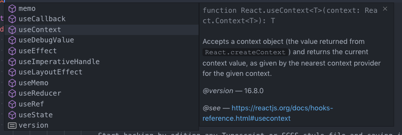
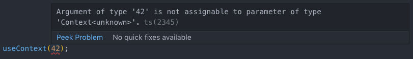
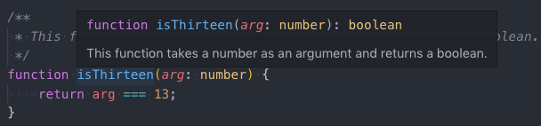

# Basics of Typescript <!-- omit in toc -->

> **TODO**: Not all advanced types have been listed yet.

- [What is Typescript?](#what-is-typescript)
- [Type Annotations](#type-annotations)
- [Basic Types](#basic-types)
  - [Arrays](#arrays)
  - [Readonly Arrays](#readonly-arrays)
  - [Tuples](#tuples)
  - [Enums](#enums)
  - [Constant Enums](#constant-enums)
  - [Any](#any)
  - [Unknown](#unknown)
  - [Null and Undefined](#null-and-undefined)
  - [Never](#never)
- [Advanced Types](#advanced-types)
  - [Type Aliases](#type-aliases)
  - [Intersection Types](#intersection-types)
  - [Union Types](#union-types)
  - [Generics](#generics)

## What is Typescript?

Typescript is a statically typed subset of Javascript, i.e. all valid Javascript code is valid Typescript code, but not the other way round. Using Typescript we can write robust code that is checked during the compile time preventing various kinds of mistakes and errors. Furthermore consuming third party libraries becomes much easier since you don't have to guess the types of arguments as code is self-documenting:



In this example you can see that the `useContext` method has one argument named `context` of type `React.Context<T>`. Trying to assign a value that isn't sensible already yields an error in the editor:



Previously in Vanilla Javascript and without relying on sophisticated tools, you'd see no errors and your application would behave erroneously in the browser causing cryptic error messages making it really difficult to trace the error.

Microsoft has developed Typescript to make Javascript scale and more bearable at the cost of some overhead writing slightly more code, but strictly checking everything you attempt to do.

## Type Annotations

Type annotations in Typescript are lightweight ways to record the intended contract of a function or variable. By adding `: Type` to those elements we can annotate them and make the compiler aware of their contracts:

```typescript
const variable1: number = 42;
const variable2: string = "Hello, Typescript";
const variable3: boolean = "wrong type";
//    ~~~~~~~~~
// error: Type '"wrong type"' is not assignable to type 'boolean'.

/**
 * This function takes a number as an argument and returns a boolean.
 */
function isThirteen(arg: number): boolean {
    return arg === 13;
}

const result1: boolean = isThirteen(42);
const result2: boolean = isThirteen("42");
//                                  ~~~~
// error: Argument of type '"42"' is not assignable to parameter of type 'number'.
const result3: string = isThirteen(42);
//    ~~~~~~~
// error: Type 'boolean' is not assignable to type 'string'.
```

As you can see, not only variables but function arguments and function return values can be annotated to make the compiler keep track of them and nag you if you make and mistake. However the above code contains a lot of verbose annotations and fortunately, most of them can be stripped. Typescript is able to infer a lot of information and implicit types just from the usage. The above snippet can be written as the following:

```typescript
const variable1 = 42;
const variable2 = "Hello, Typescript";

/**
 * This function takes a number as an argument and returns a boolean.
 */
function isThirteen(arg: number) {
    return arg === 13;
}

const result1 = isThirteen(42);
```

Hovering over the `isThirteen` function in VS Code will yield the inferred return type annotation:



Even more complex type inferrences are possible:

```typescript
const isThirteen = (arg: number) => arg === 13;
// Inferred as lambda type: (number) => boolean
```

## Basic Types

Typescript is aware of the usual Javascript types `boolean`, `number` and `string` but allows for more complex types.

### Arrays

Typescript allows you to work with arrays that are defined like in most other programming languages as follows:

```typescript
const list: number[] = [3, 1, 4, 1, 5];
```

Once again the type annotation can (and should) be omitted, since it can be inferred from the right hand side, nonetheless we're using in all of the upcoming examples to explicitly show how to work with them.

### Readonly Arrays

Immutability is another tool to leverage when writing robust code, so Typescript provides the ability to annotate arrays as readonly with a terse syntax:

```typescript
const list: readonly number[] = [3, 1, 4, 1, 5];
list.push(9);
//   ~~~~
// error: Property 'push' does not exist on type 'readonly number[]'.
```

### Tuples

While arrays are dynamic in size and usually contain only one type of element tuples can be used to describe arrays of fixed length whose element types are known, such key/value pairs:

```typescript
const value = 42;
const kvPair1: [string, number] = ["key", value];
const kvPair2: [string, number] = ["key", 31];
const kvPair3: [string, number] = ["key", "value"];
//                                        ~~~~~~~~
// error: Type 'string' is not assignable to type 'number'.
```

Furthermore accessing the elements of this array will correctly retrieve their types allowing for correct calls to `kvPair1[0].substring(1)` for example. Accessing elements out of bounds will fail since tuples have a fixed size.

### Enums

A feature native to Typescript are enumerations used to assign human readable names to compile-time constant values and group them together.

```typescript
enum Shapes {
    Circle,
    Square,
    Triangle,
}

const someShape = Shapes.Circle;
const someOtherShape = Shapes.DoesNotExist;
//                            ~~~~~~~~~~~~
// error: Property 'DoesNotExist' does not exist on type 'typeof Shapes'.
```

In enums the first element is usually automatically assigned the number `0` with all other elements being increments of the previous. Thus the previous snippet is equivalent to the following:

```typescript
enum Shapes {
    Circle = 0,
    Square = 1,
    Triangle = 2,
}
```

However, you can assign custom integral values to your enum items. Furthermore enums do not have to define integral values, they can be used for strings as well:

```typescript
enum ErrorMessages {
    InternalServerError = "An internal server error has occurred.",
    NotFound = "The requested resource wasn't found on the server.",
}
```

> **Warning**
>
> Be careful when working with enums, especially when serializing their values to a store such as a database. By adding or removing new enum values previously stored values might no longer align with the names and values defined in your code. In order to prevent anomalies you should always write tests that assert your enum values stay the same and/or are in the same order.

Enums allow you to perform reverse lookups wherein numerical value can be mapped to the respective stringified names.

```typescript
enum Shapes {
    Circle,
    Square,
    Triangle,
}

const shapeName: string = Shapes[1];
console.log(shapeName); // Displays 'Square'
```

> **Warning**
>
> This reverse lookups do not work for enums with string values.

### Constant Enums

When compiling enums a lot of code is internally created to allow reverse lookups which might not be necessary most of the time. You can optimize this by enabling so-called type erasure for enums by making them constant and inlining their values. This means no traces of the actual enumeration will be in the generated code which transforms the following snippet

```typescript
const enum Colors {
    Red,
    Black,
    Green,
    White,
}

const colors = [Colors.Red, Colors.Black, Colors.Green, Colors.White];
```

into this terse definition

```typescript
var colors = [0, 1, 2, 3];
```

which reduces bundle size.

### Any

When using 3rd party libraries or working with dynamic data that you can't clearly type you can opt-out of type checking entirely (unless your Linter complains about opting out) by using the `any` type.

```typescript
let anyVariable: any = 42;
anyVariable = "this can be a string as well";
anyVariable = false;

let anyList: any[] = [42, "variable", false];
anyList[1] = 314;
```

The `any` can be used to opt-out of type checking in legacy code that you migrate piece by piece.

> **Warning**
>
> `any` should be used only rarely when you really need it. Not only do you lose type checking capabilities for variables and functions annotated with `any`, you will even lose code completion capabilities of your editor.
>
> Furthermore using `any` can cause error that could've been caught during compile time to happen during runtime. Be really careful when relying on this type.

### Unknown

Just recently Typescript has introduced the `unknown` type as a type-safe alternative to `any`. We've seen that you can assign virtually `any`thing (duh.) to an `any` variable. Since you opt-out of type checking using `any` the following snippet will compile, but might throw errors during runtime:

```typescript
let variable: any = 42;
variable = "string";
variable = false;

const value1 = variable.call.some.method.thatDoesntExist();
const value2 = variable[3];
const value3 = new variable();
```

In order to prevent those erroneous calls and assignments allowed by `any` we can leverage `unknown`. It allows assigning `any` value to it, but unlike `any` you can only assign an `unknown` variable to `any` or `unknown` and nothing else. Furthermore no attempted method calls are allowed at all.

```typescript
let variable: unknown = 42;
variable = "string";
variable = false;

const value1 = variable.call.some.method.thatDoesntExist();
//             ~~~~~~~~
// error: Object is of type 'unknown'.
const value2 = variable[3];
//             ~~~~~~~~
// error: Object is of type 'unknown'.
const value3 = new variable();
//                 ~~~~~~~~
// error: Object is of type 'unknown'.

const anyVariable: any = variable;
const unknownVariable: unknown = variable;
const boolVariable: boolean = variable;
//    ~~~~~~~~~~~~
// error: Type 'unknown' is not assignable to type 'boolean'.
```

### Null and Undefined

Typescript distinguishes between variables defined as `null` or actually being `undefined`. Variables eplicitly have to be assigned `null` in order to describe that there is no data. `undefined` however is the value of variables that haven't been assigned at all or explicitly being assigned `undefined`. Colloquially `undefined` is equivalent to an optional value that might not have to exist.

> **Information**
>
> In the official coding guidelines of the Typescript and VS Code team `null` is forbidden and they enforce to use `undefined` only. This reduces possible errors and confusion between the two types.

Typescript is able to deduce whether a variable is defined in a specific scope when you try to access it:

```typescript
let someObjectThatMightBeUndefined = /* ... */;

const value1 = someObjectThatMightBeUndefined.getValue();
//             ~~~~~~~~~~~~~~~~~~~~~~~~~~~~~~
// error: Object is possibly 'undefined'.

if (someObjectThatMightBeUndefined !== undefined) {
    // This works just fine, since Typescript knows the object definitely isn't
    // undefined in this scope and we even get code completion
    const value2 = someObjectThatMightBeUndefined.getValue();
}
```

### Never

Values of type `never` should, as the name implies, never occur at all. This is the case for methods that throw errors since they won't return an actual value (not even `undefined`) so they return a value of type `never` which indicates an unreachable end point.

Furthermore in some edge cases where Typescript isn't able to infer types from usage, it will default to `never`. For example using the `Array.reduce` method on an empty array will cause Typescript to bail on the following snippet:

```typescript
const neverArray = [1, 2, 3].reduce((previous, next) => previous, []);
```

From the usage of the second argument `[]` it is unclear of which type it is, not even `any[]`. Therefore `[]` is of type `never[]` and thus is `neverArray`. Even the following snippet that actually tries to work with the accumulator value will fail:

```typescript
const neverArrayAgain = [1, 2, 3].reduce((previous, next) => [...previous, next], []);
//                                                           ~~~~~~~~~~~~~~~~~~~
// error: Type 'number' is not assignable to type 'never'.
```

We are attempting to append a `number` to a `never[]` which isn't posible since `never` is incompatible to all other types, even `any`.

## Advanced Types

Most of the intimidating magic in Typescript stems from the type system and writing custom types using a vast array of syntactical elements and helper types. We will be looking into (rather abstract) examples where we want to type complex objects.

### Type Aliases

We can use type aliases to create a new name for a type. This is useful if you are for example describing the attributes of an UI component and want to collect them into a single type:

```typescript
type ComponentProperties = {
    stringAttribute: string;
    numberAttribute: number;
    isThirteen(arg: number): boolean;
};
```

Type aliases can be used to rename various different types:

```typescript
// In React component properties are usually called props.
type Props = ComponentProperties;
type Action = () => void;
type NumberPredicate = (value: number) => boolean;
```

### Intersection Types

Often it is necessary to drop the object-oriented codestyle and work with injected attributes using *mixins*. In the context of functional programming this is related to higher-order functions or in the context of React previously known as working with higher-order components.

Using such a mixin will yield an object that has been extended with further attributes. We can attempt to sketch a function, that might merge two objects into one that will look like this:

```typescript
type ObjectTypeA = {
    stringVariableA: string;
    numberVariableA: number;
};

type ObjectTypeB = {
    booleanVariableB: boolean;
    functionInB(): void;
};

// This intersection type ...
type IntersectionOfAandB = ObjectTypeA & ObjectTypeB;
// ... is equivalent to this manually written type.
type ManualIntersectionOfAandB = {
    stringVariableA: string;
    numberVariableA: number;
    booleanVariableB: boolean;
    functionInB(): void;
};

// This is a simple method that merges both objects using spread syntax.
const merge = (objA: ObjectTypeA, objB: ObjectTypeB): ObjectTypeA & ObjectTypeB
    => ({...objA, ...objB});
```

### Union Types

Another useful syntactic element are union types used to describe that an "either/or" type. You can write a function that doesn't restrict its argument to a single type, but to multiple ones.

```typescript
const unionMethod = (arg: number | string) => /* ... */;
```

This method accepts either a `number` or a `string` and is internally implemented in a way that both types are handled correctly. A similar notion exists for variables that needs some intuition when working with them:

```typescript
class Human {
    public speak() { /* ... */ }
    public move() { /* ... */ }
}

class Insect {
    public move() { /* ... */ }
}

const entity: Human | Insect = getEitherHumanOrInsect();
entity.move();
entity.speak();
//     ~~~~~
// error:
// Property 'speak' does not exist on type 'Human | Insect'.
//   Property 'speak' does not exist on type 'Insect'.
```

When attempting to access members of the `entity` variable we (any Typescript) can certainly assume that it has the `move` method since it is contained in both `Human` and `Insect`. However trying to invoke `speak` might fail during runtime since we did not distinguish between either types yet and Typescript is complaining.

Union types especially allow us to denote optional / possibly undefined variables as follows:

```typescript
type Props = {
    requiredString: string;
    optionalNumber: number | undefined;
};
```

In fact Typescript provides the question mark operator `?` to remove the necessity of adding `| undefined` to all optional variables:

```typescript
type Props = {
    requiredString: string;
    optionalNumber?: number/* | undefined */;
};
```

### Generics

It can happen that you end up with a type, method or class that you can apply similar in the context of various types. A rather artificial example is the following:

```typescript
const numberToString = (arg: number) => `${arg}`;
const booleanToString = (arg: boolean) => `${arg}`;
const dateToString = (arg: Date) => `${arg}`;
// ...
```

You'll most likely notice that the only difference is the annotated type so we could use a union type to combine all allowed types:

```typescript
const unionToString = (arg: number | boolean | Date) => `${arg}`;
```

This can end up being quite convoluted when you support many types and just want a *generic* method for virtually all types. Thus *generics* have been borrowed from other programming languages that are placeholder for types:

```typescript
function toString<ArgType>(arg: ArgType) {
    return `${arg}`;
}
```

> **Warning**
>
> The method `toString` has been intentionally written as `function` rather than a lambda. In combination with React and some extensions to Typescript this won't work without a minor tweak that is out of scope for this chapter.

Now you can invoke this method as follows:

```typescript
const string1 = toString<number>(42);
const string2 = toString<boolean>(false);
const string3 = toString<number>("string");
//                               ~~~~~~~~
// error: Argument of type '"string"' is not assignable to parameter of type 'number'.
const string4 = toString(42);
```

In the last invocation especially you should notice that once again Typescript is able to deduce a type, in this case a generic type, from its usage.

Generics exist for classes and other types as well:

```typescript
type Maybe<T> = T | undefined;

type ResponseCode = Maybe<{ value: number; }>;
// Is equivalent to
type ResponseCodeFull = { value: number; } | undefined;

class Component<PropsType, StateType> {
    props: PropsType;
    state: StateType;

    public setState(newState: StateType): StateType {
        /* ... */
    }
}
```
